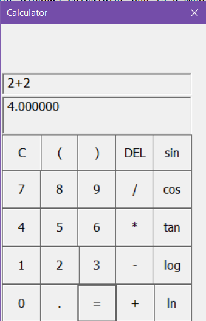

# Calculator
The Windows Calculator app is a Windows app written in C++ 17 in Visual Studio 2017 for practice Win32 API skills.
The app provides standard calculator functionality.

## License
Copyright (c) Mileta Kirill. All rights reserved.

Licensed under the [MIT License](LICENSE).
